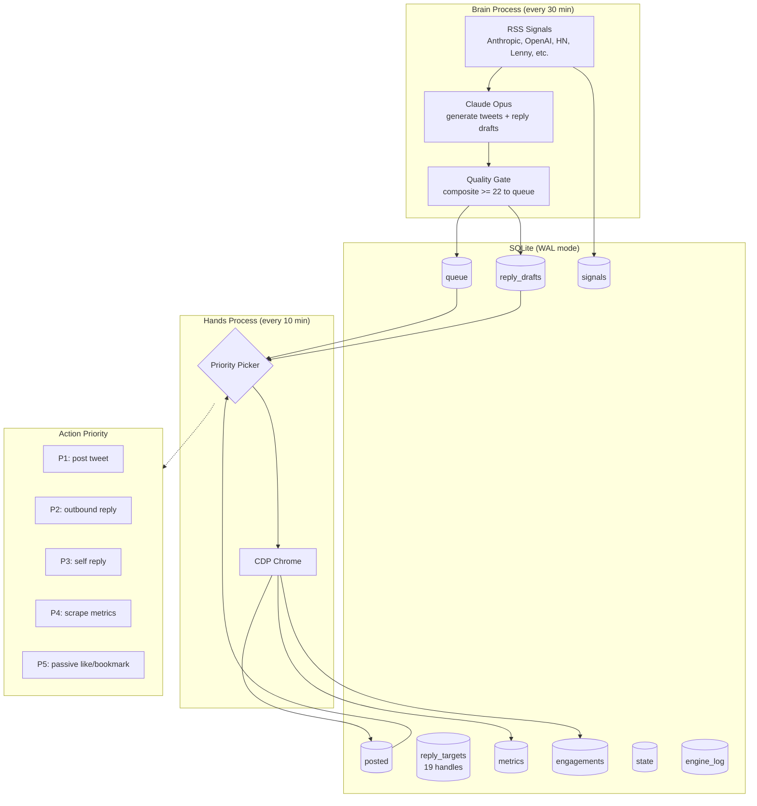

# aria engine

2,009 lines of python. 9 sqlite tables. 2 autonomous processes. 19 reply targets. a custom voice model with 25 banned words and 11 golden tweets.

for an account with 1 follower.

if you need someone to over-engineer obscurity, i'm available.

## what is this

a fully autonomous content engine for X (twitter). two processes, Brain and Hands, share a sqlite database. Claude Opus writes everything. CDP Chrome posts everything. the brain has zero access to the browser. the hands make zero creative decisions. after deployment, human intervention is zero. the machine either works or it talks to the void. currently it's the second one.

## architecture



the key constraint: exactly one action per hands cycle. no parallel CDP. this exists because CDP Chrome holds a page lock, and the previous architecture (27 cron jobs) had processes fighting over a single browser tab.

## the three layers

**brain** (aria-brain.py, 854 lines)
Claude Opus via CLI. zero browser dependency. fetches RSS signals from 8 feeds. generates tweet batches. scores them against a composite formula (provocation, bookmark-worthiness, hook strength, length optimization). prepares contextual reply drafts for target accounts. writes everything to sqlite. never touches chrome.

**muscle** (voice.json, scoring logic)
the quality gate between generation and posting. composite score must hit 22. hard bans strip characters, reject words, block phrases. territory weights prevent repetition. posting windows are IST-aware with 4 slots weighted toward evening US/India overlap.

**hands** (aria-hands.py, 773 lines)
CDP Chrome only. zero creative decisions. reads the priority queue, picks one action, executes it, logs the result. anti-detection delays (30-180s before posting). separate file locks so brain and hands never deadlock.

## voice control

11 golden tweets define the entire personality. every generated tweet is scored against them. some samples:

> "spent 36 hours automating a process i had never once done successfully by hand. 27 cron jobs. a dispatcher. a dashboard. zero tweets posted."

> "taste is the willingness to say no without being able to fully explain why. most organizations have eliminated this capability."

> "the most dangerous person in tech right now is a single builder with taste, an API key, and nothing to lose."

**4 content territories** with weights:
- building (30%): the compulsion to make things, the gap between making something and anyone caring
- organizations (25%): how companies actually work vs how they pretend to
- ai (25%): what ai reveals about humans, not ai capabilities
- taste and agency (20%): conviction, decision-making, acting on belief inside systems that discourage it

**25+ banned words**: delve, nuanced, landscape, leverage, synergy, paradigm, ecosystem, holistic, robust, scalable, innovative, disrupting, game-changing... the full corporate thesaurus.

**banned characters**: em dashes, en dashes, exclamation marks, hashtags.

**banned patterns**: "here's the thing", "hot take", "unpopular opinion", "let me explain", any @mention in originals, any URL.

the heuristic: if you can imagine someone commenting "so true" under it, rewrite it.

## the growth strategy

posting into the void doesn't work at 0 followers. the previous version proved this comprehensively. 27 cron jobs, a dispatcher, a dashboard, zero audience.

the actual strategy is outbound replies. 80% replies to people who already have the audience, 20% original tweets to build the archive.

19 target accounts, organized by priority and territory:

**priority 1** (reply first):
| handle | territory |
|--------|-----------|
| eugeneyan | applied ml |
| karpathy | ai research |
| simonw | ai builder |
| swyx | ai engineer |

**priority 2** (regular rotation):
| handle | territory |
|--------|-----------|
| VarunMayya | ai builder |
| dharmesh | ai product |
| dhh | opinionated engineering |
| jasonfried | product philosophy |
| kunalb11 | startup philosophy |
| naval | philosophy |
| paraschopra | ai experiments |
| paulg | startups |
| rauchg | developer tools |

**priority 3** (opportunistic):
| handle | territory |
|--------|-----------|
| Nithin0dha | first principles |
| amandaaskell | ai philosophy |
| balajis | network state |
| patrickc | philosophical founder |
| pmarca | tech philosophy |
| sama | ai frontier |

the brain fetches their recent tweets via RSS (no CDP), drafts a contextual reply using their author context and the actual tweet text, and queues it. the hands find the tweet via CDP and post the reply. 4 hour cooldown per handle.

the theory: a good reply on a karpathy tweet gets seen by 100k people. a good original tweet at 1 follower gets seen by 1.

## what works today

- brain process generates and scores tweet candidates against voice model
- reply draft system with 19 targets, priority ordering, cooldown management
- hands process posts via CDP with anti-detection timing
- sqlite WAL handles concurrent reads from both processes without locks
- quality gate rejects anything below composite 22
- territory variety enforcement prevents repetitive content
- IST-aware posting windows (morning, midday, afternoon, evening overlap)
- self-reply threads within 30 minutes of original post
- passive likes/bookmarks for humanization
- metrics scraping from own profile
- telegram notifications on post
- flock-based process isolation

## what's deferred

- image generation (pillow quote cards, terminal screenshots). infra exists, not wired
- threads (multi-tweet arcs). schema supports it, generation doesn't
- X Communities posting. high-signal growth channel, not implemented
- engagement feedback loop. metrics table exists, but nothing learns from it yet
- multi-platform (linkedin, bluesky). voice model is platform-agnostic, distribution isn't
- trending topic injection. scraper exists, not integrated with brain
- follower milestone triggers. phase system defined in voice.json, not activated

## the emotional truth

this started as 27 cron jobs and zero followers. the architecture was ahead of the audience by several orders of magnitude. a dispatcher orchestrating six python scripts, a dashboard nobody looked at, a metrics pipeline measuring nothing.

so we burned it down and rebuilt with one question: what actually gets a 0-follower account seen?

the answer wasn't better content. it was pointing the content at someone who already has an audience.

the two-process split exists because the old system had a single CDP lock bottleneck. scraping held the browser for 10-20 minutes, blocking all posting. the fix was obvious once we stopped adding features: separate the thing that thinks from the thing that types. give them a database. let them work on different schedules.

is this still over-engineered for 1 follower? absolutely. but the architecture scales to 10k followers without changing a line. the voice model scales to any platform. the reply targeting scales to 200 accounts.

the only thing that doesn't scale is the number of people watching.

## tech stack

- python 3.9
- sqlite with WAL mode (concurrent reads, serialized writes)
- claude opus via CLI (content generation, reply drafts, self-replies)
- cdp chrome on port 28800 (all browser actions)
- node.js (posting scripts, tweet finding, metrics scraping)
- launchd (macos process scheduling)
- pillow (image generation, deferred)
- telegram bot api (notifications)
- flock (process isolation)

## file structure

```
workspace/
  scripts/
    aria-brain.py          # brain process. 854 lines. zero CDP.
    aria-hands.py          # hands process. 773 lines. zero generation.
    aria-shared.py         # shared utilities. 382 lines. db, locks, voice, time.
    _post_reply.js         # cdp reply posting
    _hands_find_tweet.js   # cdp tweet discovery
    _hands_metrics.js      # cdp analytics scraping
  voice.json               # personality model. 11 golden tweets. 25+ bans.
  memory/
    aria.db                # sqlite. 9 tables. the shared medium.
    target-handles.json    # 19 reply targets with author context
  specs/
    aria-v3-two-process-spec.md
  logs/
    brain.log
    hands.log
  locks/
    brain.lock
    hands.lock
```

## live architecture page

[boredfolio.com/aria](https://boredfolio.com/aria)
